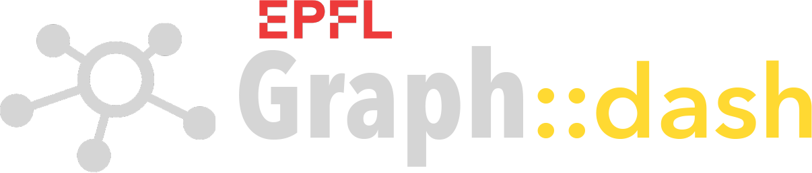

Why Graph?
==========
The *Graph Data Platform* - developed by the AI engineering team at the [EPFL Center for Digital Education](https://www.epfl.ch/education/educational-initiatives/cede/) - is an open-source alternative to proprietary research information systems like Elsevier Pure. It federates educational and institutional data into a semantically interconnected knowledge graph of people, publications, labs, startups, courses, video lectures, and other educational resources. The [GraphSearch](https://graphsearch.epfl.ch/en) application provides lightning-fast search and discovery of the knowledge graph, as well as LLM-powered [chatbot](https://graphsearch.epfl.ch/en/chatbot) interaction with the indexed resources.

**List of Graph services:** 
[Registry](https://github.com/epflgraph/graphregistry) |
[AI](https://github.com/epflgraph/graphai) |
[Ontology](https://github.com/epflgraph/graphontology) |
[Search](https://github.com/epflgraph/graphsearch_ui) |
[Chat](https://github.com/epflgraph/graphchatbot) |
Dash |
[DB client](https://github.com/epflgraph/graphdb-client) |
[ES client](https://github.com/epflgraph/graphes-client) |
[SDK](https://github.com/epflgraph/graphsdk) |
[Agents](https://github.com/epflgraph/graphagents) |

Graph Dash
==========
*Graph Registry* is the first layer in the Graph Data Platform. It ingests data in JSON format through an ETL pipeline, and generates a knowledge graph that feeds the GraphSearch and GraphChat applications.

Data can be added to the registry through direct JSON file imports, or through a REST API. The actions steps in the knowledge graph construction are executed through a command line interface (CLI).
